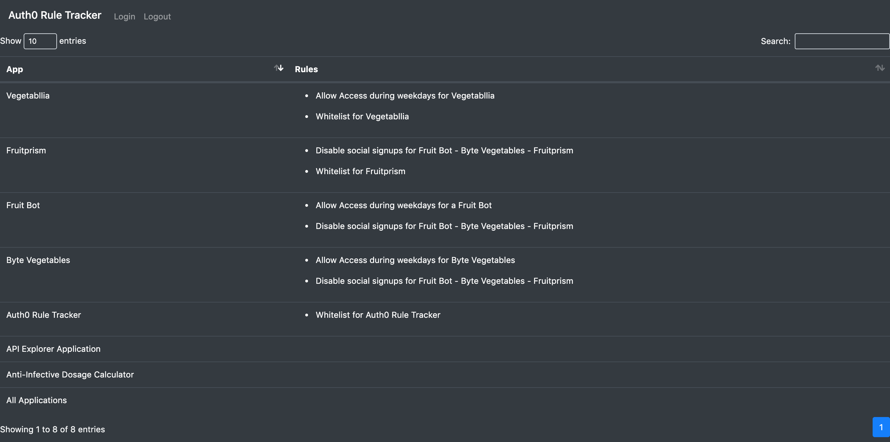

# Auth0 Rule Tracker

## Description
Web app that pulls a list of [Rules](https://auth0.com/docs/rules) associated with an [Auth0](https://auth0.com/) tenant and lists them by application.

## Author
[Ellen Conley](https://github.com/egconley)

## Built With
- [Auth0](https://auth0.com/docs/)
- [Auth0 Management API](https://auth0.com/docs/api/management/v2)
- [Java](https://www.java.com/en/)
- [Spring Boot](https://spring.io/projects/spring-boot)
- [Gradle](https://gradle.org/)
- [gson](https://github.com/google/gson)
- [Bootstrap](https://getbootstrap.com/)
- [DataTables](https://datatables.net/)

## Resources
- [Auth0 Java Spring MVC Tutorial](https://auth0.com/docs/quickstart/webapp/java-spring-mvc)

## Setup Instructions

### From your Auth0 Account
1. Create a new *Regular Web Application* in your Auth0 account, and name it *Auth0 Rule Tracker*.
    - Note the **Domain**, **Client ID** and **Client Secret**.  You will need them for the next section.
    - Under **Allowed Callback URLs**, enter http://localhost:8080/callback   
    - Under **Allowed Logout URLs**, enter http://localhost:8080
2. If you do not already have an *API Explorer Application* in your account, create a new *Machine to Machine Application* and select the *Auth0 Managment API*
    - Note the **Client ID** and **Client Secret**.  You will need them for the next section.
3. Under *Rules*, create new Rule using the *Whitelist for a Specific App* template.  
    - On `line 10` of the *Script*, replace `NameOfTheAppWithWhiteList` with `Auth0 Rule Tracker`
    - On `line 14` of the *Script*, add the desired whitelisted email addresses to the `whitelist` array.

### On your local machine
4. Clone the Rule-Tracker repository to your local machine.
5. Open the project in [IntelliJ](https://www.jetbrains.com/idea/).
6. Add `auth0.properties` to your project `.gitignore`.
7. In the `src/main/resources` folder, navigate to the `auth0.properties` file.  Replace the `xxxx` of each value with your own credentials.
    - `com.auth0.domain: xxxxx.auth0.com`
    - `com.auth0.tenant: xxxxx`
    - `com.auth0.ruleTrackerClientId: xxxxx` *this value should be the **Client ID** from your new **Auth0 Rule Tracker** application*
    - `com.auth0.ruleTrackerClientSecret: xxxxx` *this value should be the **Client Secret** from your new **Auth0 Rule Tracker** application*
    - `com.auth0.APIClientID: xxxxx` *this value should be the **Client ID** from your new **API Explorer Application** application*
    - `com.auth0.APIClientSecret: xxxxx` *this value should be the **Client ID** from your new **API Explorer Application** application*
8. Navigate to `Auth0TechnicalExerciseApplication.java` and click the green play button to run the app.
9. In your browser, navigate to http://localhost:8080/ and sign in with a whitelisted email. You should be redirected to http://localhost:8080/portal/home.  It should like this [deployed demo](https://rule-tracker.herokuapp.com/), but populated with the data from your own tenant.

### Demo

